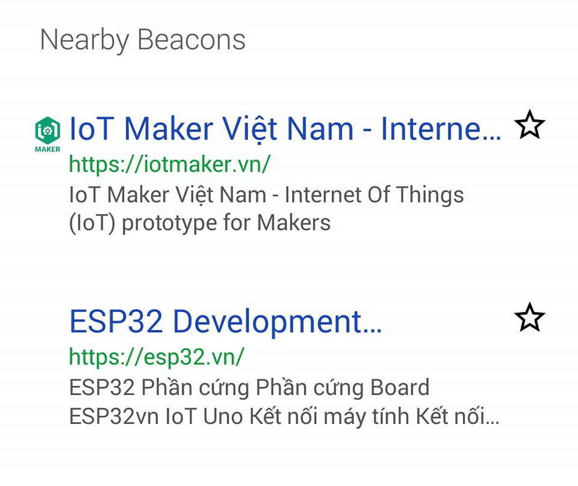
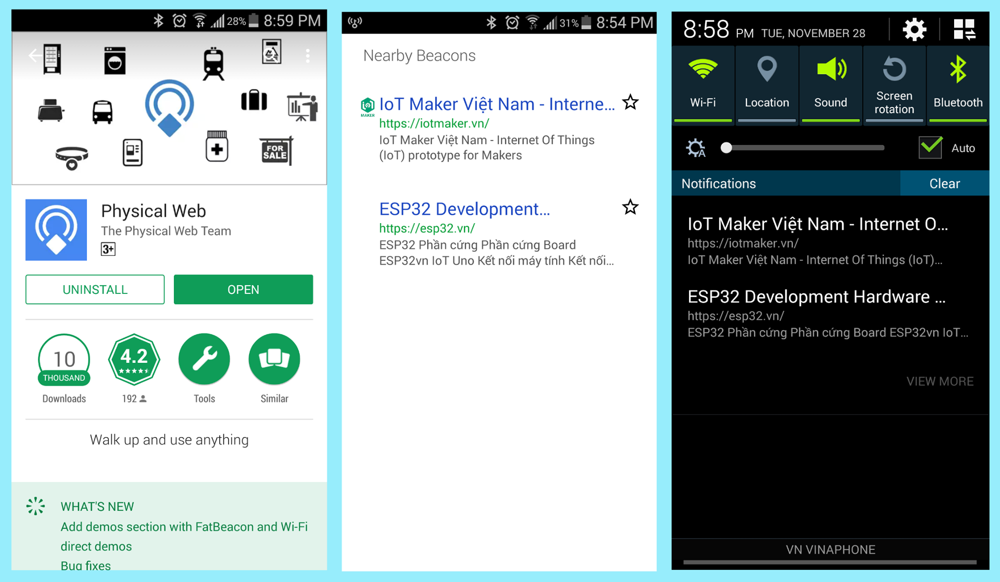

# Beacon

## Tổng quan

Beacons sử dụng công nghệ BLE-[Bluetooth Low Energy](https://en.wikipedia.org/wiki/Bluetooth_Low_Energy) ( còn được gọi là Bluetooth Smart), với ưu điểm nổi bậc là siêu tiết kiệm năng lượng, điều này cho phép các thiết bị Beacons **hoạt động liên tục từ 6 tháng đến 1 năm chỉ với một viên pin nhỏ**. Khoảng cách truyền tín hiệu cũng lên đến 100m như Classic Bluetooth.

Bên cạnh ưu điểm tiết kiệm năng lượng, các thiết bị Beacon có kích thướt ngày càng nhỏ ( chỉ bằng một viên pin CMOS) phù hợp với rất nhiều ứng dụng như:

- Giám sát chuyển động ( Indoor Location).

- Quảng bá địa chỉ trang Web.

- Cung cấp thông tin của thiết bị ( nhiệt độ, điện áp,..) cho người dùng.

- Và rất nhiều ứng dụng khác như: tìm vị trí xe trong bãi, thông tin sản phẩm và khuyến mãi trong cửa hàng, hướng dẫn di chuyển trong sân bay,...

## Quảng bá địa chỉ Web (Physical Web)

Đây là một ứng dụng rất hay của Beacon giúp bạn có thể quảng bá địa chỉ URL mà bạn muốn. Khi mọi người đến gần thiết bị Beacon đều có thể nhận được địa chỉ URL của bạn.

## Cách sử dụng

Để nhận được URL từ thiết bị Beacon, chúng ta cần các yếu tố sau:

- Smartphone có hỗ trợ Bluetooth 4.0 trở lên ( hầu hết các smartphone hiện nay đều hỗ trợ)

- Phần mềm **PHYSICAL Web** hoặc các phần mềm có thể Scan được Beacon.

### PHYSICAL Web

Sau khi tiến hành cài đặt ứng dụng từ **CH Play**. Danh sách các URL từ các Beacon mà ứng dụng quét được sẽ hiện lên màn hình. Ngoài ra, ứng dụng còn thông báo cho người dùng ở phần **Notifications**

Ngoài ra còn một cách để bạn nhận được URL từ các Beacon đó là thông qua trình duyệt Chrome trên smartphone.

Bạn tiến hành mở ứng dụng Google Chrome vào **Cài đặt** chọn **Privacy** , tiếp theo chọn **Physical Web**. Trong mục **Physical Web** bạn bật **On** và nhấp vào mục **SEE WHAT'S NEARBY** để quét.

